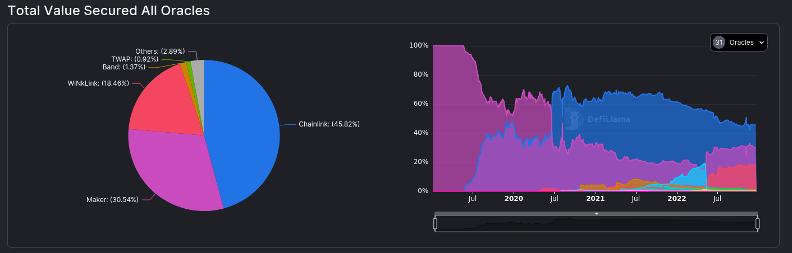
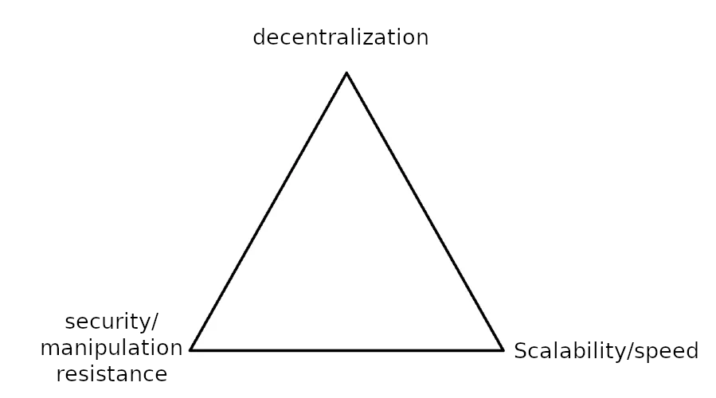
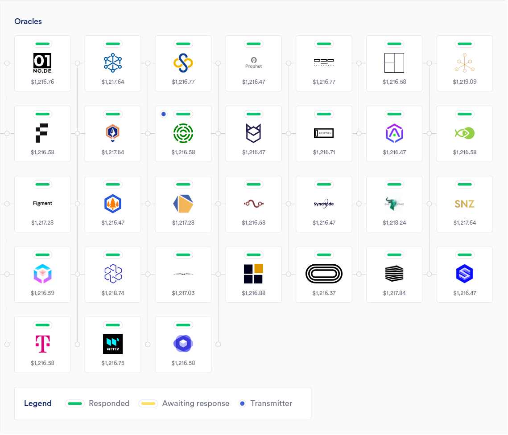

Price oracles are a crucial necessity, but also a great weakness for DeFi. Most DeFi projects use centralized oracles
with no fallback, which means that they are a single point of failure. In this post, I will do a deep dive into oracles,
and especially decentralized ones, and provide multiple potential solutions to problems facing them.

## TLDR

If you can't be bothered to read the whole blog post, which is fine, here are some important takeaways:

- decentralized oracles are good, centralized oracles are bad
- decentralized oracles are hard to do properly
- a decentralized oracle should never take the face value of a single source. something like an index/TWAP is necessary
for the oracle to be usable
- having a centralized oracle with a fallback to a decentralized one is usually an acceptable trade off

## The current state of oracles

Centralized oracles (mostly chainlink) are used by almost all top DeFi protocols. In my opinion this is a
rather reckless thing to do, as all protocols that use chainlink, with no good fallback, are at their mercy. No project
that relies on external centralized services can rightfully claim to be decentralized.

Currently, around 65% of DeFi TVL is at the mercy of centralized oracles. The only big protocol that's truly independent 
is Maker. Currently Maker oracles are securing 30% of all TVL; and while their oracle solution is a very nice 
thing to see, it should be noted that they currently have way bigger systemic risks than oracles. 
It should also be noted that a very large majority of projects *do not* have fallbacks in case 
chainlink experiences a catastrophic failure.

### Why centralized oracles are so widespread

When creating a DeFi protocol that needs to get price data, it's important to make sure that the data
is as recent as possible and as resistant to manipulation as possible. Decentralized oracles face the same trillema 
blockchains do. If you prioritize speed, you lose security in the form of manipulation, and vice versa.

One of the main reasons behind chainlink's dominance is that its seen as a good compromise between speed and security.
Chainlink is fast, and has a strong brand, so it's seen as a safe bet. It's also very easy to integrate chainlink into
your protocol.

## How dangerous are centralized oracle schemes?

We have already established that centralized oracles that can be gamed by a small number of entities are bad. But how
dangerous is this? We're going to focus on chainlink for our analysis, as it is the biggest centralized oracle securing
the most TVL.   

To get a definitive answer of the risks involved we need to look at how chainlink works. 
[According to the chainlink docs, ](https://docs.chain.link/architecture-overview/architecture-decentralized-model/)
each data feed is updated by chainlink node operators. These node operators communicate with each other in a process 
called OCR (Off-chain reporting). They then come to consensus on what price should be posted on chain by signing a
message that contains their suggested price. When they reach consensus, the transaction that contains the price update
gets sent *if the price of the underlying asset moves by a certain threshold* from the last update or *if a certain amount
since the last update has passed (known as the heartbeat threshold).*  

The OCR committee for the ETH/USD price feed on mainnet at the time of writing consists of 31 oracles. If enough members
of the committee cooperate to pass the quorum, the price can be set arbitrarily. For reference, here are the members
currently present in the committee:

 

While it's very unlikely that enough members of the committee would collude and manipulate the price, it's still a
possibility.   

In my opinion, DeFi protocols should be designed to be fully sovereign and autonomous. The protocol should work the same
way today and in 100 or more years. Being reliant on chainlink or other similar centralized oracle schemes adds systemic
risk. While it may be a fine compromise today, will that still hold true in 100 years?

 

## Decentralized oracles

Enter decentralized oracles.   

Before we do a deep dive it is important to mention that there are generally 2 major types of decentralized oracles. 